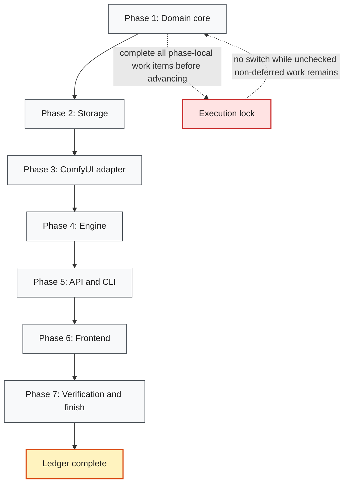

# H3 Lab Phases

**Spec:** `2026-08-07-h3lab-design.md`
**Surface map:** `2026-08-07-h3lab-surfaces.md`
**Plan:** `../plans/2026-08-07-h3lab.md`
**Status:** Complete
**Current Phase:** Phase 7 — closed

## Global Phases

- [x] Phase 1: Domain core — settings, config identity, judgement math, scoring, insights, sweeps
- [x] Phase 2: Storage — migrations, row-level repositories, legacy import
- [x] Phase 3: ComfyUI adapter — client, progress, graph patching, catalog
- [x] Phase 4: Engine — events, artifacts, executor, durable queue
- [x] Phase 5: API and CLI — FastAPI routes, SSE, SPA hosting, entry point
- [x] Phase 6: Frontend — scaffold, design system, five pages
- [x] Phase 7: Verification and finish — surface-matched evidence, docs, remove superseded code

## Phase Roadmap

## Current Phase Work Items

### Phase 1: Domain core — complete

- [x] `h3lab/settings.py` — Settings from env + CLI, every path configurable
- [x] `h3lab/domain/config.py` — `GenerationConfig`, canonical form, `config_hash`, `recipe_hash`
- [x] `h3lab/domain/run.py` — `Run`, `RunMetrics`, `Artifact`, `RunStatus`, id/seq/label
- [x] `h3lab/domain/rating.py` — `Rating`, `Vote`, Elo replay
- [x] `h3lab/domain/scoring.py` — percentile normalisation, `Score`, leaderboard order
- [x] `h3lab/domain/insights.py` — marginal + paired axis analysis, verdicts with n
- [x] `h3lab/domain/sweeps.py` — `SweepSpec` expansion with seed strategies
- [x] Domain tests with worked-example expected values (no tautologies)

Evidence: `pytest tests/test_settings.py tests/test_domain_config.py
tests/test_domain_judgement.py tests/test_domain_insights.py -q` → 73 passed. Three real
defects were found and fixed by these tests: `ScoreWeights` rejected un-normalised slider
values, the paired speed delta was asymmetric under pair sorting, and the marginal caveat
copy did not say "confounded".

### Phase 2: Storage — complete

- [x] `h3lab/storage/db.py` + `migrations.py` — WAL, busy_timeout, forward-only versions
- [x] `h3lab/storage/runs.py` — `RunRepository` row-level writes, filters, pagination
- [x] `h3lab/storage/judgement.py` — ratings and votes
- [x] `h3lab/storage/library.py` — presets and app state (baseline pin)
- [x] `h3lab/storage/legacy.py` — idempotent import of `results/benchmark.db`
- [x] Storage tests on real temp SQLite files

Evidence: `pytest tests/test_storage.py -q` → 33 passed, including the regression test for
the old bug class (`test_updating_one_run_does_not_touch_a_sibling`) and both legacy-import
tests.

### Phase 3: ComfyUI adapter — complete

- [x] `h3lab/comfy/client.py` — queue, history, view, interrupt, object_info, WS
- [x] `h3lab/comfy/progress.py` — ported `sec_per_it` derivation with plausibility rules
- [x] `h3lab/comfy/nodes.py` + `graph.py` — node roles, explicit chain rebuild, pruning
- [x] Per-mode media wiring inside `graph.py` (keyframes, references, text-only)
- [x] `h3lab/comfy/catalog.py` — options and model discovery with TTL cache
- [x] `h3lab/comfy/presets.py` — cache and attention levels kept on separate nodes
- [x] Prompt-builder tests asserting the invariants the old suite asserted

Evidence: `pytest tests/test_comfy_graph.py tests/test_comfy_progress.py
tests/test_comfy_client.py -q` → 97 passed. The graph tests run against the three real
workflow templates in the repository, not fixtures, and assert `missing_links == []` for
every cache × attention × toggle combination. The client tests run against a real
`ThreadingHTTPServer` on a live socket. `parse_combo` handles both ComfyUI descriptor
shapes; the single-shape version would have returned no sampler options on current builds.

### Phase 4: Engine — complete

- [x] `h3lab/engine/events.py` — typed `EventBus` with bounded per-subscriber queues, replay
- [x] `h3lab/engine/artifacts.py` — ffprobe facts, poster, filmstrip, fail-soft
- [x] `h3lab/engine/runner.py` — worker loop, preflight, cancel, reconcile, requeue
- [x] `h3lab/engine/lab.py` — the facade: enqueue, sweeps, judging, leaderboard, insights
- [x] Engine tests with a fake ComfyUI client and real ffmpeg-rendered clips

Evidence: `pytest tests/test_engine.py -q` → 56 passed. The artifact tests synthesise a real
2s clip with ffmpeg and assert the probed shape and that the filmstrip is wider than a
poster. A real concurrency defect was found here: `pause()` could land while the worker was
already inside `claim_next()`, so a paused lab still started a run (reproduced at ~50% over
six runs). Fixed with a post-claim recheck plus `RunRepository.requeue`, guarded on status
so a finished run can never be resurrected. Six consecutive clean repeats recorded.

A second design defect surfaced: paired insight groups pooled seeds, so three seed-matched
replicates of an A/B counted as one group and could never reach a verdict. Pairing now
matches on the seed (the strongest available control) and falls back to seed-pooled
comparison only when the two sides were never run at a matching seed, labelled `matched_on`
so a weak comparison cannot pass as a controlled one.

### Phase 5: API and CLI — complete

- [x] `h3lab/api/schemas.py` + `app.py` + `deps.py` + `errors.py` + `factory.py`
- [x] Route modules: lab (status/catalog/meta), runs+sweeps, judge, analysis, library, media, events
- [x] `h3lab/cli.py` — `serve`, `check`, `import-legacy`, `routes`
- [x] API tests over a real socket and via ASGI transport, asserting bodies for every family
- [x] CLI subprocess tests asserting exit code and stdout

Evidence: `pytest tests/test_api.py -q` → 74 passed; `pytest tests/test_cli.py -q` → 21
passed. Both surfaces are verified the way they are met: the API through real HTTP (an
in-thread uvicorn server for the SSE and end-to-end tests, ASGI transport for the rest) and
the CLI through `python -m h3lab` as a subprocess asserting exit codes and stdout.

(The whole-suite figure recorded here during Phase 5 was 452, counted while the superseded
`bench/` tests were still present. Phase 7 removed them; the current suite is 368. The
per-file numbers above are re-verified against the code as it now stands.)

Five real defects were found by these tests:

1. `/api/meta` crashed building config defaults, because two of three modes have no valid
   empty instance. `field_defaults()` now reads declared defaults field by field.
2. `config_diff` reported `cache_enabled` alongside `cache`, so every cache comparison
   carried a duplicate row and — worse — paired insight grouping saw two differences where
   one existed and refused to draw a verdict. Derived fields are now suppressed when their
   determinant already differs.
3. An event payload could shadow the SSE envelope: `run.created` carried the run's ordinal as
   `seq`, overwriting the stream cursor a reconnecting client sends back as `Last-Event-ID`.
   Payloads are now nested under `data` and the ordinal is named `run_seq`.
4. FastAPI only flattens a Pydantic query model when it is the sole query parameter, so
   `/api/leaderboard?limit=…` silently bound the weights to a nested object and returned the
   wrong shape. `limit` moved inside `LeaderboardQuery`, with a regression test.
5. `check` could not build the `flf2v` or `r2v` templates, because it probed them with an
   empty config those modes reject; it now derives a satisfying probe from `MODE_NEEDS`.

`httpx.ASGITransport` buffers the whole response, so an infinite SSE stream hangs it. The
`live_server` fixture runs a real uvicorn instance in a thread for those tests.

### Phase 6: Frontend — complete

- [x] Vite + React + TS + Tailwind v4 + Base UI scaffold in `web/`
- [x] Design tokens, fonts, app shell (rail + Bench tray)
- [x] API client, generated-mirror types, contract test, React Query + SSE wiring
- [x] Filmstrip and gang-sync transport components
- [x] Lab page (config builder, presets, sweep builder, live queue)
- [x] Runs page (filters, keyboard judging flow)
- [x] Compare page (transport, diff table, votes)
- [x] Insights page (paired first, marginal labelled, delta chart)
- [x] Leaderboard page (weights, score decomposition, guardrails)
- [x] Vitest DOM tests, `tsc -b --force`, production build

Evidence: `npm run typecheck` → exit 0; `npm test` → 9 files, 73 tests passed;
`npm run build` → built, `dist/assets/index-*.js` 622 kB (196 kB gzipped).

Types are generated from the backend's own OpenAPI schema by `scripts/gen_types.py`, and
`tests/test_contract.py` fails when they drift. It earned itself during Phase 7: adding
`previews_built` to `ImportReport` turned the suite red until the types were regenerated,
which is precisely the class of failure — a renamed field reaching the browser as
`undefined` — that neither `pytest` nor `tsc` can see alone.

Base UI replaced the planned shadcn primitives where they disagreed; the shadcn CLI stays as
a dev dependency for scaffolding. Its `Select` and `Slider` needed explicit `aria-label`
plumbing before the DOM tests could address them by role, which is the same plumbing a
screen reader needs.

### Phase 7: Verification and finish — complete

- [x] Full backend suite green; record command output
- [x] Frontend tests + typecheck + build green; record output
- [x] Real browser smoke test, or honest env-limit note with the launcher error
- [x] Legacy data imported and visible; record row counts
- [x] README rewrite; `CONTEXT.md` terms cross-checked against code identifiers
- [x] Remove superseded `bench/`, `ui/`, `benchmark_runner.py`, old tests
- [x] Ledger closed with evidence

**Backend (library/core, data layer).** `pytest -q` → **375 passed**, 2 warnings, 49s.

**The real thing, end to end.** ComfyUI turned out to be running on this machine with an RTX
5090, so the last untested surface — an actual generation — was tested for real rather than
against the fake client. `POST /api/runs` with a 6-step t2v config: queued, claimed, patched,
executed on the GPU, **44.4 s wall / 6.73 s/it**, video downloaded (549 kB, 672×384, 24 fps,
56 frames), poster and filmstrip rendered. The filmstrip shows the prompt it was given (a
paper boat in a rain-filled gutter at dusk), so the whole chain — config → graph → sampler →
download → probe → preview — is verified against reality, not a stub.

That single run found three defects no test in the suite could have found. See below.

**Front end (UI).** Browser-driven, not substituted: `python scripts/smoke.py` seeds a
throwaway database with 16 runs that have real ffmpeg-rendered clips, serves `web/dist` from
the real app on a real socket, and drives Chromium through every route. All ten steps green,
console clean. It asserts more than "it rendered": no horizontal overflow on any page, a
filter that actually reduces the card count, a sweep that stays disabled while its base
config is invalid, and a rating that survives a reload.

**HTTP/API.** Real requests throughout `tests/test_api.py` (74 tests) — an in-thread uvicorn
server for SSE, ASGI transport elsewhere — asserting bodies, not just status codes.

**CLI.** `tests/test_cli.py` (21 tests) invokes `python -m h3lab` as a subprocess and asserts
exit codes and stdout.

**Legacy data.** `python -m h3lab import-legacy` against the real `results/benchmark.db`:
38 runs, 4 ratings, 26 videos imported; re-running reports 38 already present and imports
nothing. Final row counts: 38 runs (26 succeeded, 10 failed, 2 cancelled), 4 ratings, 1
app-state row; 26 runs carry a video and all 26 now carry a poster and filmstrip.

**Docs.** README rewritten around what the lab is for rather than which flags it takes;
`requirements.txt` split from `requirements-dev.txt`. `CONTEXT.md` cross-checked against code
identifiers, which caught two drifts: the glossary named an event `vote.created` that the bus
publishes as `vote.added` (and listed 6 of 12 kinds), and it described paired comparison
without the seed **match level** that Phase 4 introduced. Both corrected.

Four unused front-end dependencies were dropped (`cmdk`, a second font family) and the
`shadcn` CLI moved to `devDependencies`, where a build-time scaffolding tool belongs.

Five defects surfaced during this phase's verification, all fixed test-first.

Two came from the live generation and one from reading the failure it produced. These are the
ones that mattered most, because the entire test suite was green while all three were present:

1. **The default cache preset could not run at all.** `SpectrumApplyMiniMaxH3` defaults
   `bootstrap_first_forecast` on and then refuses `warmup_steps > 1`; the moderate (2) and
   aggressive (3) levels both violated it, and moderate is the lab's default. Every run at
   default settings failed at node 122 *after* the GPU had been committed. `missing_links`
   said the graph was fine, and it was — structurally valid is not runnable. Fixed by deriving
   `bootstrap_first_forecast` from `warmup_steps` in `cache_widgets`, which is also the
   semantically right reading: the bootstrap means "forecast from the first step", so a real
   warmup makes it redundant rather than desirable. Red tests
   `test_a_warmup_longer_than_one_step_turns_the_bootstrap_off` (all three levels) and
   `test_a_custom_warmup_also_turns_the_bootstrap_off`. Re-running the identical config after
   the fix succeeded — that rerun is the 44.4 s run above.
2. **The failure message buried its own cause.** `_describe_messages` joined ComfyUI's whole
   status history in order, so the reason landed last behind `execution_start` and
   `execution_cached` — sixty characters of bookkeeping that say nothing. The run card's
   120-character cap then cut the message at `warmup_steps`, hiding the `<= 1` that said what
   to change. Explanatory entries now lead, with the silent ones kept as trailing context. Red
   test `test_the_cause_of_a_failure_leads_the_message` uses the exact string from the real
   failure.
3. **A diagnosed refusal was reported as a crash.** Queueing a run whose first frame is not in
   ComfyUI's input folder produced "the lab hit an unexpected error: …". The preflight check
   had done its job perfectly — caught it before the GPU, named the exact file — and then the
   catch-all wrapper made it read like a bug. `PreflightError`, `WorkflowError`, `ComfyError`
   and friends now report their own sentence; only genuinely unforeseen exceptions get the
   "unexpected" framing. Red test
   `test_a_diagnosed_failure_is_not_reported_as_an_unexpected_one`. Confirmed live: the
   message is now `definitely_not_a_real_frame_zzz.png is not in ComfyUI's input folder`.

The remaining two came from inspecting the imported data:

4. **Archived runs never got previews.** `RunFilter.archived` defaults to `False`, so
   `backfill_previews` iterating `runs.all()` silently skipped every archived run. This was
   visible in the real data as exactly one imported run — the one the old lab had marked
   `excluded` — holding a perfectly good 7 MB video with no poster. Archiving means hidden,
   not half-imported: un-archiving it would have shown a placeholder forever. Fixed with
   `RunFilter(archived=None, with_video=True)`; red test
   `test_an_archived_run_still_gets_its_previews`.
5. **`make_poster` and `make_filmstrip` ignored the configured `ffprobe`.** Both called
   `probe(video)` with the bare default name. Anyone whose ffprobe is off `PATH` passed the
   `tool_available` gate (which checks the configured path) and then got frame zero for every
   poster and mis-spaced filmstrip tiles, with no error to explain it. `ffprobe` now travels
   with `ffmpeg`; red test `test_the_poster_seek_uses_the_ffprobe_it_was_given` asserts a
   poster seeked from a probed duration differs from frame zero.

## Resume Notes

Last completed: Phase 7 — ledger closed. 375 backend tests, 75 DOM tests, and a ten-step
Chromium smoke run all green; 38 legacy runs imported and rendering; one real generation
completed on the GPU at 6.73 s/it.
Next action: None — the ledger is complete.
Known blockers: None.

Worth knowing for whoever picks this up: the live generation was the single most valuable
verification step of the whole build. Three defects were sitting behind a fully green suite,
including one that made the **default configuration unrunnable**. A fake ComfyUI client can
prove the lab talks correctly; only the real one proves it says anything the model will accept.

## Suggested Global Phase Changes

- None.
