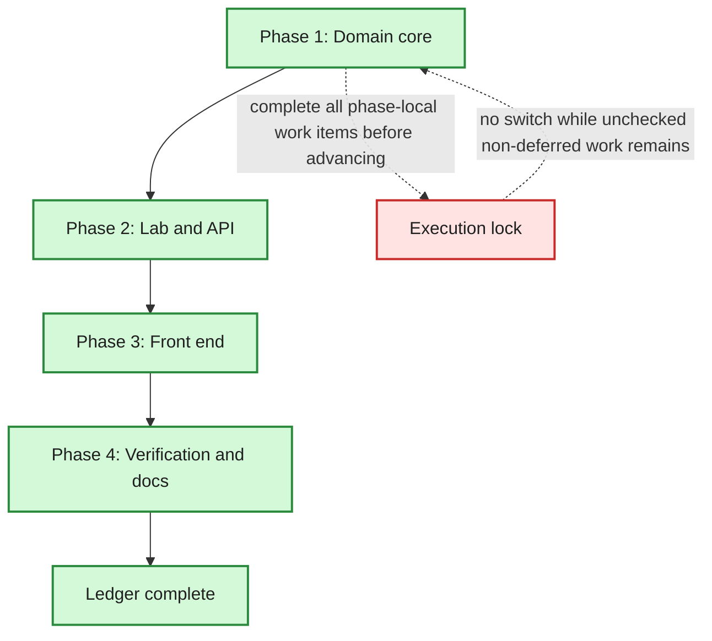

# Arena Phases

**Spec:** `2026-08-08-arena-design.md`
**Surface map:** `2026-08-08-arena-surfaces.md`
**Plan:** `../plans/2026-08-08-arena.md`
**Status:** Complete
**Current Phase:** None — every phase closed

## Global Phases

- [x] Phase 1: Domain core — held/contested partition, pool identity, matchup selection, standings, verdicts
- [x] Phase 2: Lab and API — arena facade, two routes, removal of the unfair pair picker
- [x] Phase 3: Front end — the vote page, the standings page, the rail, removal of the duel tab
- [x] Phase 4: Verification and docs — surface-matched evidence, glossary, README, ledger closed

## Phase Roadmap

## Current Phase Work Items

### Phase 1: Domain core

- [x] `h3lab/domain/rating.py` — `Standing` + `replay_pairwise`; `replay_elo` delegates to it
- [x] `h3lab/domain/arena.py` — `HELD_FIELDS` / `CONTESTED_FIELDS` / `IGNORED_FIELDS` partition of `HASHED_FIELDS`
- [x] `pool_key`, `pool_label`, `held_summary`, `contested_differences`, `loadout_key`, `loadout_label`, `value_label`
- [x] `legal_matchups` and `next_matchup` — clean first, least-voted next, seed-matched next, random tie-break, randomised sides
- [x] `standings` — clean votes per axis, every legal vote per loadout, ignored votes counted by reason
- [x] `verdict` — `|W − L| > √(W + L)` on the head-to-head record with `MIN_DECIDED_VOTES`
- [x] `tests/test_domain_arena.py` with worked-example Elo and a partition-coverage guard

Evidence: `python -m pytest tests/test_domain_arena.py tests/test_domain_judgement.py
tests/test_domain_config.py -q` → `79 passed`. The import error that opened the phase
(`ModuleNotFoundError: No module named 'h3lab.domain.arena'`) is gone.

### Phase 2: Lab and API

- [x] `Lab.arena_runs`, `Lab.arena_matchup`, `Lab.arena_standings`
- [x] Delete `Lab.next_pair` and `PairSuggestion`
- [x] `h3lab/api/routes/arena.py` — `GET /api/arena/next`, `GET /api/arena/standings`
- [x] Delete `GET /api/pairs/next`
- [x] Arena tests in `tests/test_api.py` asserting bodies, the 404 Problem and its detail
- [x] `python scripts/gen_types.py` regenerated; `tests/test_contract.py` green *(deferred to
  Phase 3: the contract test fails by design until `routes.ts` drops `nextPair` and calls the
  two arena routes)*

Evidence: `python -m pytest -q --deselect tests/test_contract.py` → `453 passed, 7 deselected`.
Route bodies asserted over a real ASGI transport in `tests/test_api.py`
(`test_the_arena_offers_a_matchup_of_two_watchable_runs`,
`test_the_standings_rank_the_setting_the_votes_chose`,
`test_the_duel_that_ignored_fairness_is_gone`).

### Phase 3: Front end

- [x] `routes.ts`, `keys.ts`, `hooks.ts` — `useArenaMatchup`, `useArenaStandings`, invalidation on vote
- [x] `web/src/pages/arena/index.tsx` — matchup, held line, A/B/tie/skip, keyboard, disclosure
- [x] `web/src/pages/arena/standings.tsx` — per-axis tabs, verdict, table with sample sizes and s/it
- [x] `web/src/pages/arena/nav.tsx` — Vote / Standings segmented links
- [x] `App.tsx` routes, `shell.tsx` rail destination
- [x] Remove the Compare page's Head-to-head tab and its tests
- [x] `web/src/pages/arena/arena.test.tsx` — vote body, tie body, skip exclusion, hidden config, empty state, standings render

Evidence: `npm test` → `107 passed` (12 new, opened red with "Failed to resolve import
`@/pages/arena/standings`"); `npm run typecheck` and `npm run build` clean;
`python -m pytest tests/test_contract.py -q` → `7 passed`, closing the deferral from Phase 2.

Deviation from plan: the disclosure renders its table only once opened, rather than hiding a
rendered table with CSS. The settings under test are then absent from the document, not
merely invisible — worth the state, since the page's whole claim is that they cannot bias
the eye.

### Phase 4: Verification and docs

- [x] `pytest -q` green; record the count → **461 passed** in 73s
- [x] `npm test`, `npm run typecheck`, `npm run build` green → **107 passed**, no type errors, bundle built
- [x] `python scripts/smoke.py` with new arena steps that cast a real vote in Chromium → every step `ok`, console clean
- [x] `CONTEXT.md` arena vocabulary; terms cross-checked against shipping identifiers
- [x] `README.md` page table and fairness rule
- [x] Surface map's verification-results table filled in from commands actually run
- [x] Ledger closed with evidence

Two faults were found by reading the Chromium screenshots rather than the tests, and fixed:
`held_summary` listed `Ref image size` beside a text-to-video pair (a fact about nothing), and
the reveal table stretched its two value columns to the full panel width.

## Resume Notes

Last completed: Phase 4 — every surface verified, docs written, ledger closed.
Next action: none. The feature is complete and the working tree is uncommitted by design
(see below).
Known blockers: None.

## Suggested Global Phase Changes

- None.

## Note on finalisation

One-shot's step 8 (`finalize-completed-work`) is not applicable here. The repository has no
remote and `master` already carried a large uncommitted rewrite before this task began, so
there is no branch to open a pull request from and no safe squash target. Committing that
pre-existing work under an arena commit message would misattribute it. The work is left in
the tree, verified, for the repository owner to stage as they see fit.
