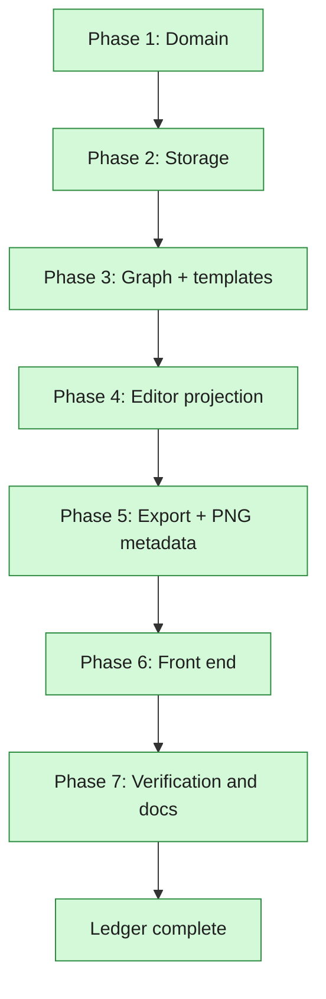

# Workflow Export and Frame Interpolation — Phases

**Spec:** `2026-08-08-workflow-export-design.md`
**Surface map:** `2026-08-08-workflow-export-surfaces.md`
**Plan:** `../plans/2026-08-08-workflow-export.md`
**Status:** Complete
**Current Phase:** none — all seven closed

## Global Phases

- [x] Phase 1: Domain — `interp` replaces `rife`, with the legacy alias, across config, arena and insights
- [x] Phase 2: Storage — migration v2 rewrites stored configs and recomputes both hashes
- [x] Phase 3: Graph — three-way interpolation wiring, the frame-rate rule, and the FILM nodes in all three templates
- [x] Phase 4: Editor projection — `h3lab/comfy/editor.py` and its round-trip property
- [x] Phase 5: Export and metadata — the Lab facade, the route, and `extra_pnginfo` on submit
- [x] Phase 6: Front end — the three-way control, the sweep axis, the download action
- [x] Phase 7: Verification and docs — real generations on live ComfyUI, suites, glossary, README, ledger closed

## Phase Roadmap



## Current Phase Work Items

### Phase 1: Domain — complete

- [x] `h3lab/domain/config.py` — `Interp` literal, `INTERP_MODES`, `INTERP_LABELS`, `interp` field, legacy `rife` alias validator
- [x] `HASHED_FIELDS`, `FIELD_LABELS`, `derive_label` follow the rename
- [x] `h3lab/domain/arena.py` — `HELD_FIELDS` and `pool_label`
- [x] `h3lab/domain/insights.py` — the axis becomes categorical
- [x] `h3lab/storage/legacy.py` — the old benchmark's `rife` column still lands as `interp`
- [x] `tests/test_domain_config.py`, `tests/test_domain_arena.py` — alias, hash change, held partition

Evidence: `python -m pytest tests/test_domain_config.py tests/test_domain_arena.py
tests/test_domain_insights.py tests/test_storage.py -q` → 124 passed.

### Phase 2: Storage — complete

- [x] `h3lab/storage/migrations.py` — `Migration.fn`, migration v2, the rewrite over `runs` and `presets`
- [x] `tests/test_storage.py` — a real pre-rename DB file opens migrated, hashes recomputed, an unparseable row survives untouched

Evidence: `python -m pytest tests/test_storage.py -q` → 39 passed. The hash test went red first
(`assert 'stale' == 'bcbfd389c4db54173c3f28e76de632d4'`).

### Phase 3: Graph and templates — complete

- [x] `h3lab/comfy/nodes.py` — `FILM_LOADER`, `FILM_INTERP`, widget orders for both classes
- [x] `h3lab/comfy/graph.py` — `_wire_video_path` picks one interpolator; `_frame_rate` follows
- [x] All three templates gain nodes 166/167, links, and a sibling group
- [x] `h3lab/comfy/progress.py` — labels for the two new nodes
- [x] `tests/test_comfy_graph.py` — one test per value, over all three templates

Evidence:
- `python -m pytest tests/test_comfy_graph.py tests/test_comfy_progress.py -q` → 112 passed.
  The FILM tests went red first (`AttributeError: 'GenerationConfig' object has no attribute
  'rife'`, then `KeyError: '167'`).
- Live ComfyUI accepted a t2v prompt for each of the three values with `node_errors {}`
  (`POST /prompt` at 127.0.0.1:8188, interrupted and queue-cleared afterwards). The FILM
  loader's `film_net_fp16.safetensors` is the only option `object_info` offers for it.

### Phase 4: Editor projection — complete

- [x] `h3lab/comfy/editor.py` — `to_editor_workflow`
- [x] `h3lab/comfy/nodes.py` — `OUTPUT_SLOTS` for the loaders `apply_config` mints
- [x] `tests/test_comfy_editor.py` — round trip, dropped nodes absent, widget values carried, synthesised nodes, provenance, layout kept, bypass cleared

Evidence: `python -m pytest tests/test_comfy_editor.py -q` → 14 passed (collection error
`ModuleNotFoundError: No module named 'h3lab.comfy.editor'` first). The export uses no key the
template does not, and the round trip holds for all three interpolation values and for an r2v
run whose reference loaders the template ships bypassed.

### Phase 5: Export and PNG metadata — complete

- [x] `ComfyClient.queue` / `.execute` accept a workflow and post `extra_data.extra_pnginfo`
- [x] `Runner._execute` builds and passes it
- [x] `h3lab/comfy/editor.py` — `run_provenance`
- [x] `Lab.workflow_for_run`
- [x] `GET /api/runs/{run_id}/workflow`
- [x] `tests/test_comfy_client.py`, `tests/test_engine.py`, `tests/test_api.py`

Evidence:
- `python -m pytest tests/test_comfy_client.py tests/test_engine.py -q` → 36 and 70 passed.
  The client tests went red first (`TypeError: ComfyClient.queue() got an unexpected keyword
  argument 'workflow'`), the route tests with `assert 404 == 200`.
- Real generation on live ComfyUI (t2v, `interp="film"`, 5 min): the PNG VHS saved beside the
  video, `output/h3lab/pngcheck_00001.png`, now carries text chunks
  `['CreationTime', 'prompt', 'workflow']`. The `workflow` chunk is editor format — 26 nodes,
  26 links, 10 groups, no `class_type` anywhere — carries `extra.h3lab.run_id`, includes node
  167 and excludes node 96.
- `ffprobe` on the produced file: `avg_frame_rate=48/1`, `nb_frames=43`. FILM Net doubled the
  frames and the muxer was told the matching rate.

### Phase 6: Front end — complete

- [x] `GET /api/meta` grows `interpolations` + `interpolation_labels`; `scripts/gen_types.py` re-run
- [x] `routes.ts`, `run.tsx` download action
- [x] `config-form.tsx` three-way control, `sweep-builder.tsx` axis, `harness.tsx` fixture
- [x] `web/src/pages/run.test.tsx` and `lab.test.tsx` cover both

Evidence: `npm test` 111 passed / 11 files; `npm run typecheck` clean; `tests/test_contract.py` 7
passed (generated types match the live schema). `npm run lint` reports only the errors that were
already there — `react-refresh/only-export-components` in the shadcn primitives and
`set-state-in-effect` in `lab/index.tsx` and `runs.tsx`; none of the files this phase touched appear.

### Phase 7: Verification and docs — complete

- [x] Three real generations on the live ComfyUI (off / film / rife); fps asserted from ffprobe
- [x] The PNG beside a real run's video carries an editor-format `workflow` chunk
- [x] `pytest -q`, `npm test`, `npm run typecheck`, `npm run build`, `tests/test_contract.py`
- [x] Browser step or a recorded environment limit
- [x] `CONTEXT.md` and `README.md`
- [x] Surface map's verification table filled from commands actually run
- [x] Ledger closed with evidence

`python scripts/verify_interp.py` — three t2v runs at 4 steps / 0.1 MP / 2s through the real
API against ComfyUI 0.30.0:

```
ok    off   24 fps (expected 24), 56 frames, 416x256, 179734 bytes
      off   png: editor graph, 24 nodes, run_id 01KZGYG94N03C4Y3YCSGKV5DHE
ok    film  48 fps (expected 48), 111 frames, 416x256, 170086 bytes
      film  png: editor graph, 26 nodes, run_id 01KZGYG96103SJQS7BYEM30072
      film  export: 26 nodes, interpolators ['FrameInterpolate', 'FrameInterpolationModelLoader']
ok    rife  60 fps (expected 60), 140 frames, 416x256, 172680 bytes
      rife  png: editor graph, 26 nodes, run_id 01KZGYG971039Z20QJS3XN3GR8
```

The frame counts are the load-bearing part: 56 → 111 is FILM's own `(n − 1) × 2 + 1`, and 56 → 140
is 2.33 s resampled to 60. A graph that had silently skipped the interpolator would have produced
56 frames at a claimed 48 fps, which the fps assertion alone would have passed.

`node web/scripts/comfy-drop.mjs` performs the reported symptom — a real `DragEvent` carrying the
saved PNG onto ComfyUI's canvas — and reads back 26 positioned nodes across 12 columns, all ten
template groups by name, 22 template titles, the FILM pair present and `RIFEInterpolation` absent.
Same result for the file from `GET /api/runs/{id}/workflow`. Full detail in the surface map.

Suites: `pytest -q` 506 passed; `npm test` 111 passed; `npm run typecheck` clean; `npm run build`
clean; `tests/test_contract.py` 7 passed; `python scripts/smoke.py` green on 15 steps with a clean
console. `npm run lint` reports only pre-existing errors, in files this work did not touch.

Docs: `CONTEXT.md` gains **Frame interpolation**, **Workflow** and **Prompt** as glossary terms and
drops the RIFE-specific wording from **Held setting**; `README.md` gains *Frame interpolation* and
*Taking a run back to ComfyUI*, and the arena and template sections now say interpolation.

## Resume Notes

Last completed: Phase 7. Every phase is closed and every surface has fresh evidence.
Next action: None — the work is done.
Known blockers: None.

Left deliberately undone, and why:

- **The FILM multiplier stays 2.** The setting exists so a run can be compared with and without
  interpolation, not so the factor can be swept. Making it configurable would add a hashed field
  and another migration for a knob with no benchmark question behind it.
- **The checkpoint is the template's widget.** Which interpolation model to load is the same kind
  of knowledge as which CLIP to load: the lab does not choose it, so a second machine with a
  different file in `frame_interpolation/` needs no code change.
- **Groups whose nodes were all dropped stay as empty boxes.** They are the template's own
  layout, and keeping them means the export is drawn exactly as the template draws it. Pruning
  them would be cosmetic work that makes the two graphs differ.
- **The export follows the template on disk, not a per-run copy.** A run *is* its config; the
  export applies that config to the template as it is now, which is the same graph the lab would
  submit if the run were queued again today. Storing a copy per run would freeze a graph nobody
  can regenerate and grow the database by ~24 KB a run.

## Suggested Global Phase Changes

- None.
