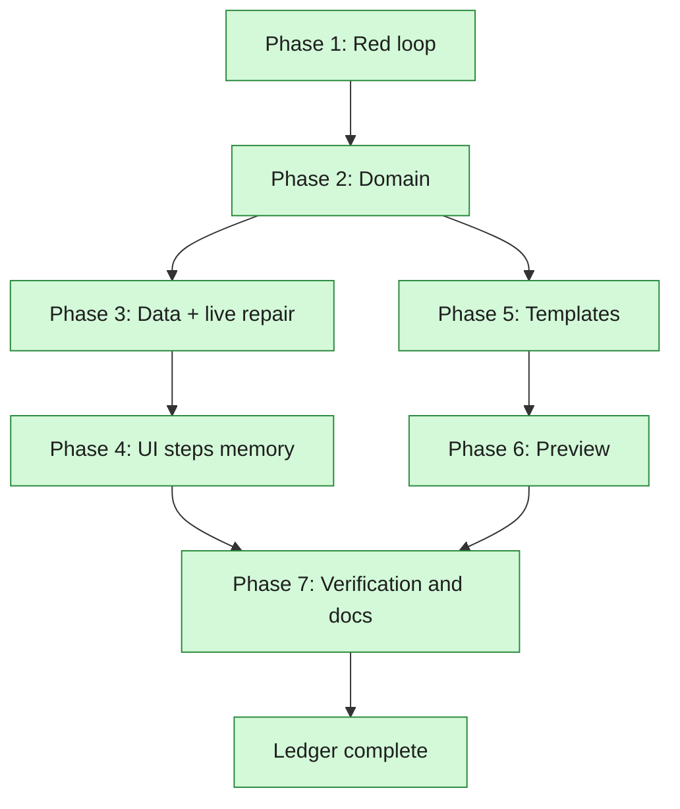

# Turbo Steps, Template Parity, and the Live Preview — Phases

**Spec:** `2026-08-11-turbo-steps-and-live-preview-design.md`
**Surface map:** `2026-08-11-turbo-steps-and-live-preview-surfaces.md`
**Plan:** `../plans/2026-08-11-turbo-steps-and-live-preview.md`
**Status:** Complete
**Current Phase:** Closed

## Global Phases

- [x] Phase 1: The red loop — a test that fails on the stale turbo step count
- [x] Phase 2: Domain — with turbo on, `steps` is the LoRA's schedule
- [x] Phase 3: Data — migration v4, and the queued runs corrected in place
- [x] Phase 4: UI — turning turbo off restores the step count, or the lab's 20
- [x] Phase 5: Templates — FLF2V and T2V gain R2V's four model-chain nodes
- [x] Phase 6: Preview — the frame ComfyUI renders reaches the queue panel
- [x] Phase 7: Verification and docs — suites, browser, live check, CONTEXT, README, close

## Phase Roadmap

## Current Phase Work Items

### Phase 1: The red loop — done

- [x] `tests/test_domain_config.py` — two turbo configs differing only in the leftover step count
      must hash alike, and a turbo config's stored `steps` must equal `effective_steps`
- [x] Red output before the fix: `assert 16 == 4`, then
      `assert '80e8...' == '69bca...'` on the pair that should have been one experiment

### Phase 2: Domain — done

- [x] `h3lab/domain/config.py` — `_mode_coherence` normalises `steps` to `turbo_steps_for(...)`
      while turbo is on; the docstring says why, in the same words as `CONTEXT.md`
- [x] `DERIVED_FROM` now maps a derived field to *all* its determinants, so a diff that already
      names `turbo` does not also name `steps`; `arena.py` and `insights.py` read the new shape
- [x] `pytest tests/test_domain_config.py tests/test_domain_arena.py tests/test_domain_insights.py`

### Phase 3: Data — done

- [x] `h3lab/storage/migrations.py` — migration v4 re-parses configs and recomputes both digests
- [x] `tests/test_storage.py` — a pre-v4 turbo row written into a real temp SQLite file comes back
      with the corrected step count and digests equal to what the model computes today
- [x] The live `results/h3lab.db` backed up and migrated
- [x] Repaired a second time (`h3lab.bak-20260811-212100.db`) after the still-running old server
      wrote eight more turbo rows past the migration: `steps 20 -> 4` and `20 -> 8`, digests with
      them. The rows the running server owns are left alone.

### Phase 4: UI — done

- [x] `web/src/pages/lab/config-form.tsx` — the count the draft had before turbo is restored when
      turbo goes off, falling back to the default of 20
- [x] `web/src/pages/lab/lab.test.tsx` — red first

### Phase 5: Templates — done

- [x] `minimax_h3_flf2v_workflow.json`, `minimax_h3_t2v_workflow.json` — the four R2V nodes, in
      R2V's order, with R2V's widget values, and nothing else touched
- [x] Both files re-read: chain asserted, every role resolves, a built prompt for each mode
      carries the four classes and dangles no link
- [x] All three templates now hold `ModelPreviewOverrideKJ` with the same widgets
      (`1024, 80, True, 1, 12, taeh3.safetensors`)

### Phase 6: Preview — done

- [x] `h3lab/comfy/progress.py` — the newest frame and a counter on the tracker; bytes never enter
      the snapshot
- [x] `h3lab/comfy/client.py` — reads the frame off the socket. **Corrected mid-phase:** the
      override node does not use ComfyUI's binary preview channel. It draws the latent itself and
      sends a `kj_preview_override` JSON message with the JPEG base64 inside, *and* switches
      ComfyUI's own previewer off while it samples (`suppress_default_preview`, on in every
      template). Read from the node's source in `ComfyUI-KJNodes/nodes/preview_override_node.py`.
      The binary path is kept for a graph without the node; the message path is the one these
      templates take.
- [x] `h3lab/engine/runner.py` — hold the newest frame for the active run; publish `preview_seq`
- [x] `h3lab/api/routes/runs.py` — `GET /api/runs/{id}/preview`
- [x] `web/src/api/events.tsx`, `web/src/pages/lab/queue-panel.tsx` — show it while in flight
- [x] Tests: tracker (both channels, and every shape that is not a picture), api (status, body,
      headers, 404 for a run that is not rendering), vitest (DOM)

### Phase 7: Verification and docs — done

- [x] `python -m pytest -q` — 638 passed
- [x] `npm test` — 124 passed; `npm run typecheck` and `npm run build` clean
- [x] `python scripts/smoke.py` — every page rendered, console clean, turbo sweep included
- [x] Binary and JSON frame shapes checked against the installed ComfyUI's own source
      (`protocol.py`: `PREVIEW_IMAGE = 1`, `PREVIEW_IMAGE_WITH_METADATA = 4`; `server.py`:
      `1 = JPEG, 2 = PNG`) rather than from memory
- [x] Six real generations on the GPU through a scratch lab on its own data directory, without
      touching the user's queue or database. What they showed, in order:
      - a config submitted with `steps: 17` and turbo on is stored as `steps: 4`, the schedule of
        the LoRA it picked, and `metrics.steps` comes back 4
      - `GET /api/runs/{id}/preview` served a real frame while the run rendered
        (`image/jpeg`, 53 KB, `Cache-Control: no-store`, `X-Preview-Seq: 1`) and 404 after it
      - the wire log settled what the node sends: `kj_preview_override` at step 0 with a JPEG of
        the noise, then one message per sampler step (`1/4` … `4/4`) carrying `video/mp4`,
        60–141 KB each. The templates wire the clip's frame count into `preview_frames`, so a
        frame is the whole shot, not a still — the first implementation rejected every one of
        them as "not an image"
      - in Chrome against the running lab: frame 1 an `` 608×352, then a `<video>` at
        `?f=2`, `readyState 4`, `paused false`, playhead moving 0.12 s → 0.48 s, console clean.
        Playwright's bundled Chromium has no H.264 and drops these clips; an installed Chrome or
        Edge is what the check uses now, and the panel hides a frame it cannot decode without
        silencing the ones after it
- [x] `CONTEXT.md`, `README.md`
- [x] Surface map's results table filled from commands actually run; ledger closed

## Resume Notes

Last completed: Phase 7. Nothing outstanding in this ledger.

Left for the user: their lab server is still running the code it was started with (19:17 local,
before the domain change), so every turbo run queued from it keeps storing the leftover step
count. Restarting it is what makes the fix live for them. The rows written that way in the
meantime were corrected in place; the backup is `results/h3lab.bak-20260811-212100.db`.
