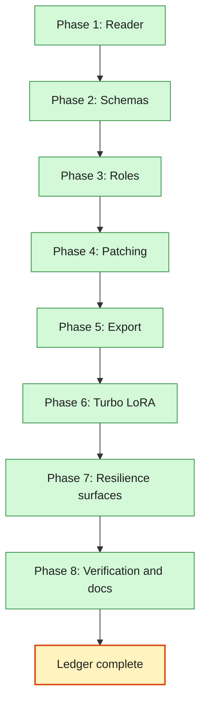

# Workflow Resilience and the Turbo LoRA Axis — Phases

**Spec:** `2026-08-11-workflow-resilience-design.md`
**Surface map:** `2026-08-11-workflow-resilience-surfaces.md`
**Plan:** `../plans/2026-08-11-workflow-resilience.md`
**Status:** Complete
**Current Phase:** Phase 8 (done)

## Global Phases

- [x] Phase 1: Reader — `h3lab/comfy/workflow.py` flattens subgraphs to ComfyUI's execution ids
- [x] Phase 2: Schemas — `h3lab/comfy/schema.py` takes widget order from the installed nodes
- [x] Phase 3: Roles — `h3lab/comfy/roles.py` names what the lab touches, with a report
- [x] Phase 4: Patching — `apply_config` thins a live set instead of rebuilding an assumed chain
- [x] Phase 5: Export — `h3lab/comfy/editor.py` projects the pruned graph as a flat editor workflow
- [x] Phase 6: Turbo LoRA — config, migration v3, catalog, graph, arena, insights, API, UI
- [x] Phase 7: Resilience surfaces — template reload, `h3lab check` role report, progress by class
- [x] Phase 8: Verification and docs — real generations, suites, smoke, README, CONTEXT, close

## Phase Roadmap

## Current Phase Work Items

### Phase 1: Reader

- [x] `h3lab/comfy/workflow.py` — `Node`, `Graph`, `read`, both link shapes, subgraph flattening
      with `:`-joined execution ids, boundary links, promoted widget values, nesting
- [x] `tests/test_comfy_workflow.py` — a hand-built subgraph fixture, then the three real templates
- [x] Boundary sentinels (`-10`/`-20`) are honoured even when `inputNode.id` disagrees

### Phase 2: Schemas

- [x] `h3lab/comfy/schema.py` — `NodeSchema`, `Schemas`, dynamic-combo expansion, offline
      fallbacks, `problems(prompt)` / `notes(prompt)`, `fill_defaults(prompt)`
- [x] `tests/test_comfy_schema.py` — live-shaped `/object_info` payloads, the drifted classes

### Phase 3: Roles

- [x] `h3lab/comfy/roles.py` — `Rule`, resolution by tag / class / edge / legacy id, `report()`
- [x] `tests/test_comfy_roles.py` — every role resolves on all three real templates

### Phase 4: Patching

- [x] `h3lab/comfy/graph.py` rewritten on the live set + type-matched pass-through
- [x] `h3lab/comfy/nodes.py` reduced to class facts: widget table, UI types, output slots
- [x] `tests/test_comfy_graph.py` — assertions by role and class, never by node id

### Phase 5: Export

- [x] `h3lab/comfy/editor.py` — flat projection with layout, groups, notes, dissolved subgraphs,
      `extra.h3lab.node_ids` for the ids a flat file cannot hold, and `prompt_of` to read it back
- [x] `tests/test_comfy_editor.py` — round trip on all three templates, up to id renaming

### Phase 6: Turbo LoRA

- [x] `h3lab/domain/config.py`, `arena.py`, `insights.py` — two hashed fields, contested, axes
- [x] `h3lab/storage/migrations.py` — migration v3 rewrites configs and recomputes both digests
- [x] `h3lab/comfy/catalog.py` — LoRA lists from the installed node's own combo options, the
      step count per LoRA, and a disk scan then the shipped name as fallbacks
- [x] `h3lab/comfy/graph.py` — the LoRA file and strength written by whichever name the node has
- [x] `h3lab/api/routes/lab.py`, `scripts/gen_types.py` — meta and generated types (`/meta` is
      built from the same constants, so both fields, their labels and the axis arrived with no
      route change; `schema.ts` regenerated)
- [x] `web/src/pages/lab/config-form.tsx`, `sweep-builder.tsx`, `lib/config.ts`,
      `lib/format.ts`, `lib/limits.ts` — picker and strength nested under the Turbo toggle, the
      step count the LoRA implies, `turbo_lora` and `turbo_lora_strength` as sweep axes, and a
      warning when a LoRA axis is swept with turbo off
- [x] Tests: domain, storage, graph, api, contract, vitest

### Phase 7: Resilience surfaces

- [x] `h3lab/engine/runner.py` — `WorkflowCache` reloads on mtime+size, announces it on the event
      bus; the run builds through `build()` so the sampler for `sampler_cached` comes from the
      role, not from id 10
- [x] `h3lab/comfy/schema.py` — `SchemaCache`: `/object_info` read once, dropped when a prompt is
      rejected, so a node pack installed mid-session is picked up without a restart
- [x] `h3lab/comfy/progress.py` — labels by class (`labels_for`), preferred sampler by class
- [x] `h3lab/cli.py` — `check --roles` prints the role table; every workflow row now includes the
      live `/object_info` problems, and a template whose essential roles are gone fails the check
- [x] `web/src/api/events.tsx` — `lab.message` is shown as a toast, so a reload is visible
- [x] Tests: engine (3 reload + progress label + schema re-read), progress (labels, fallback,
      sampler preference), cli (role rows, `--roles` table, `--roles --json`), vitest (toast)

### Phase 8: Verification and docs

- [x] `scripts/verify_workflow.py` — seven real generations on the live ComfyUI: one per template,
      a template renumbered on disk between two runs, and two different turbo LoRAs
- [x] `pytest -q` (618), `npm test` (120), `npm run typecheck`, `npm run build`, `test_contract.py`
- [x] `python scripts/smoke.py` (every page, clean console, plus a `turbo-lora` step that drives
      the picker, the schedule, the strength and the sweep), `node web/scripts/comfy-drop.mjs` on
      an exported flf2v workflow (33 positioned nodes, 9 groups, 29 titles kept)
- [x] Real sockets: `GET /api/catalog`, `/api/meta`, `/api/runs/{id}`; `POST /api/runs`,
      `/api/sweeps/preview`, `/api/sweeps` against `python -m h3lab serve`
- [x] `CONTEXT.md` — role, execution id, node schema, Turbo LoRA, template reload, contested list
- [x] `README.md` — *Surviving workflow changes*, *The Turbo LoRA*, `check --roles`,
      `H3LAB_LORAS_DIR`, `verify_workflow.py`, module layout, test counts
- [x] Surface map's verification table filled from commands actually run; ledger closed

## Resume Notes

Last completed: Phase 8. The ledger is closed. Every phase has evidence in this file and in the
surface map's results table.
Next action: none — the work is done. If a template changes again, the loop is
`python -m h3lab check --roles` then `python scripts/verify_workflow.py`.

Phase 8 evidence:

- `python scripts/verify_workflow.py` — re-run at ledger close: 4m26s, exit 0, seven real
  generations on the live ComfyUI (#1–#7).
  t2v, flf2v and r2v each produced a 56-frame 416×256 clip (2.772, 2.304 and 1.264 s/it).
  A copy of the t2v template renumbered by +5000 on disk *between* two runs ran successfully with
  **0 of 20 node ids shared** with the run before it (`169:1` → `5169:5001`) — the exact edit that
  broke the previous version. Two turbo LoRAs
  (`minimax_h3_fl2v_lightx2v_turbo_4step_v0.1_comfy`, `minimax_h3_turbo_4step_comfyui_pruned`)
  each ran, each graph named only its own file, and the two configs hashed differently
  (`a6f4b08fd11c` vs `c8f8b4478221`). Every export read back into a prompt (23→20, 31→28, 30→27
  nodes), and the installed nodes objected to nothing in any of the three templates.
- `python -m pytest -q` — **618 passed**, from `102 failed, 404 passed` at the start. One flake
  found and fixed on the way: `test_the_worker_runs_a_queued_run_to_completion` drained the event
  bus as soon as storage said `succeeded`, which is a moment before the worker announces it, so
  it lost `run.finished` about once in a few hundred runs. It now waits for the event.
- `npm test` — 120 passed in 11 files. `npm run typecheck` and `npm run build` clean.
- `python scripts/smoke.py` — every page rendered, console clean, a run rated and a graph
  downloaded and read. The new `turbo-lora` step drives the feature end to end in Chromium and
  caught a defect every jsdom test had passed over: with turbo on, the steps field still showed
  the count the run would ignore (28) instead of the LoRA's schedule (4). Fixed after a red test
  (`shows the schedule in the steps field, and gives the typed count back`), which also pins that
  turning turbo off hands the typed count back rather than keeping the LoRA's.
- `node web/scripts/comfy-drop.mjs` on an exported flf2v workflow — ComfyUI's own frontend built
  33 positioned nodes in 18 columns, all 9 groups, 29 template titles, and read the run stamp.
- Real sockets against `python -m h3lab serve`: catalog 200 (4 turbo LoRAs, `source=comfy`),
  meta 200 (`Turbo LoRA` categorical axis, `Turbo strength` numeric), `POST /api/runs` 201
  labelled `turbo/4step_ema_ckpt850@0.75`, sweep preview 200 with two distinct hashes,
  `POST /api/sweeps` 201 queueing two strengths.
- `python -m h3lab check --roles --json` — exit 0, 13/13 checks, 2937 node classes, 37-row role
  table per mode, no guessed role and no missing essential role.

Phase 7 evidence:

- `pytest tests/test_engine.py tests/test_comfy_progress.py` — 86 passed, including the three
  reload tests (edited file re-read, reload announced, untouched file not re-read), the progress
  label test (`node_label == "Sampler"` on a `169:`-prefixed id) and the schema re-read on
  rejection.
- `pytest tests/test_cli.py` — 24 passed, three of them new: a `roles <mode>` row per template,
  the `--roles` table naming the node and the rule that found it, and the same report in JSON.
- `python -m h3lab check --roles` against the running ComfyUI — 13/13 checks pass, 2937 node
  classes read, 34/37 roles on flf2v and 33/37 on t2v and r2v, no `/object_info` problems.
- `npx vitest run src/api/events.test.tsx` — 8 passed, one new: a `lab.message` becomes a toast.
- `pytest -q` — 618 passed.

Known blockers: None. ComfyUI is running on this machine (2937 node classes answered), so the
live `/object_info` and real generations are both available.

Phase 6 evidence:

- `pytest tests/test_domain_config.py tests/test_domain_arena.py tests/test_domain_insights.py`
  — 99 passed, including the arena's exhaustive partition check with both new fields classified.
- `pytest tests/test_storage.py` — 41 passed, with two new tests that write a pre-v3 row into a
  real SQLite file and assert the LoRA fields and both digests after the migration runs.
- `pytest tests/test_comfy_client.py` — 39 passed, including the LoRA list read from a live
  `/object_info` payload, the disk fallback, and the shipped-name fallback.
- `pytest tests/test_api.py -k "turbo or lora or meta or catalog"` — 8 passed over the real app,
  asserting body content: the catalog's picker list, the meta axis, a queued run that reports
  its LoRA and an 8-step label, a two-LoRA sweep with two distinct hashes, and a strength
  preview.
- `pytest tests/test_contract.py` — 7 passed after `python scripts/gen_types.py`.
- `npx vitest run src/pages/lab/lab.test.tsx` — 23 passed, 7 of them new and all red first:
  the picker is absent until turbo is on, the picked LoRA is what gets queued, the form names
  the schedule the LoRA implies, an unknown LoRA from a preset is kept, the strength slider
  moves by keyboard, the sweep axis lists the catalog's files, and a LoRA sweep with turbo off
  says it is one run repeated.

## Suggested Global Phase Changes

- None.
